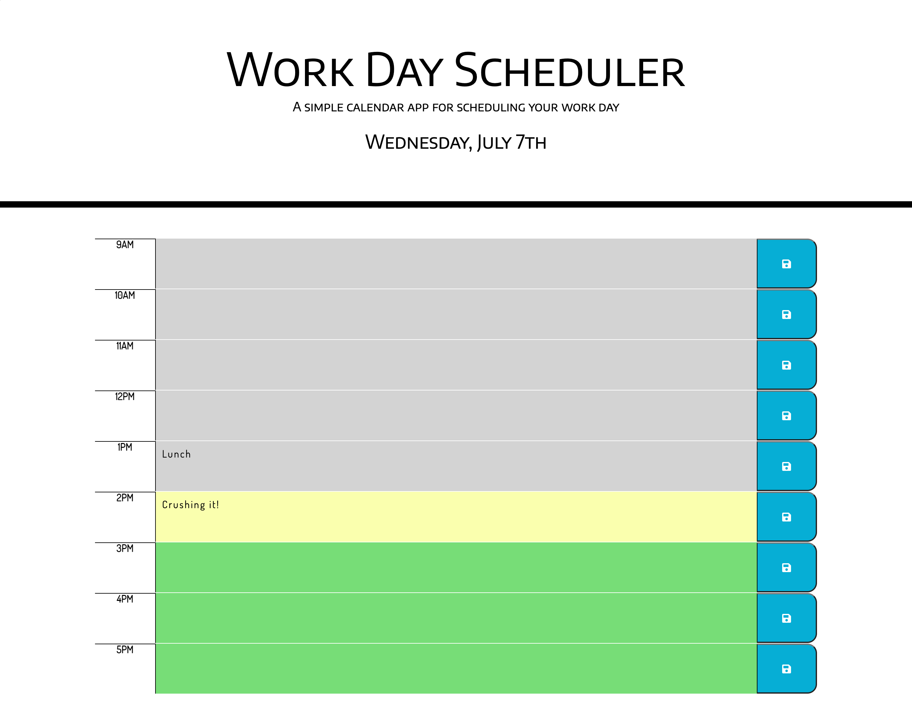
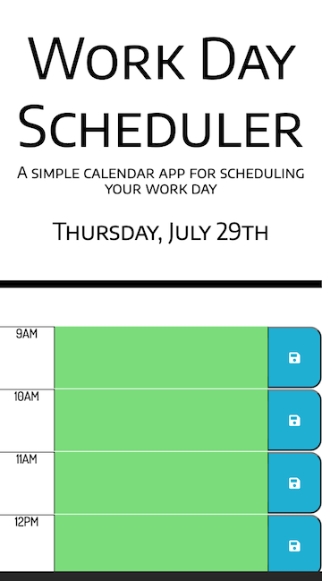

# Day Planner

## This application is designed to keep track of events throughout the day

 * The live [web application](https://jeffmullen.github.io/day-planner/).

## Technologies

* Moment.js

* JavaScript

* Bootstrap

* jQuery

* CSS

* HTML

## Features

 * Heading of page displays the current date.

 * Time slots are color coded according to the time of day.
    
    * Grey means that it is in the past.

    * Yellow means that it is the present time.

    * Green means that is is in the future.

* Clicking inside of the timeblock allows you to enter an event.

    * When save button is clicked, events are saved in local storage.

* Loading the page will populate timeblocks with previously saved entries.

## Contact

* If you would like to collaborate feel free to reach out: jeffmullendev@gmail.com

## Webpage

### Mobile Responsive

